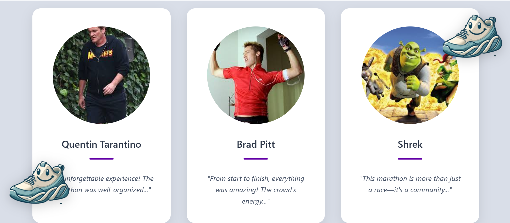

# Marathon Landing Page

## Description
This landing page is designed to promote and sell tickets for a 10 km race in Chisinau. I was inspired by websites that sell tickets for running events. The page provides essential details about the race, including the event’s purpose, testimonials from past participants (my friends btw🙃), pricing, and frequently asked questions. 

The goal of this page is to attract runners of all levels by offering a clear and engaging experience while making the registration process simple.

## Screenshots
### Hero Section  
  
This is the header of the page. The button "Join now" links to the "Price" section.

### Unique Value Proposition (UVP)  
  

### Reviews  
  
Here are the reviews from the BEST REAL participants of previous races.

### Price Section  
  

### FAQ  
  

### Contact Information  
  
This is the footer of the page.

### Mobile friendly example  
  
This is the footer of the page.

## Live Demo
[Link to the page](https://elena-nidelcu.github.io/landing-page/) 
(Using GitHub pages)
